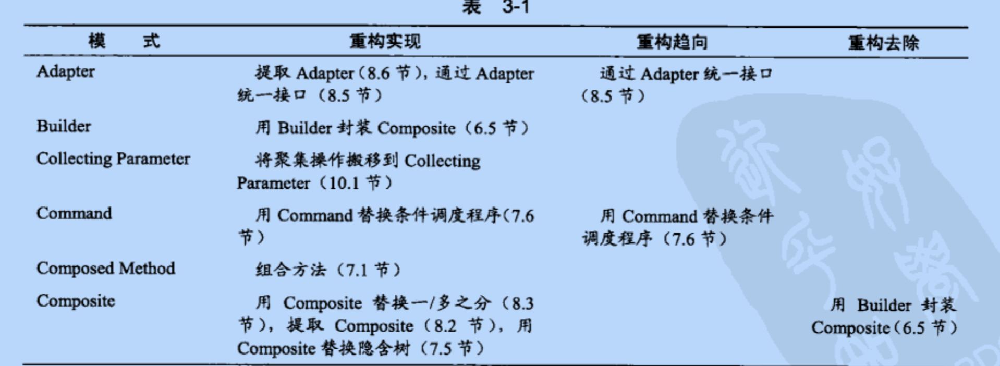
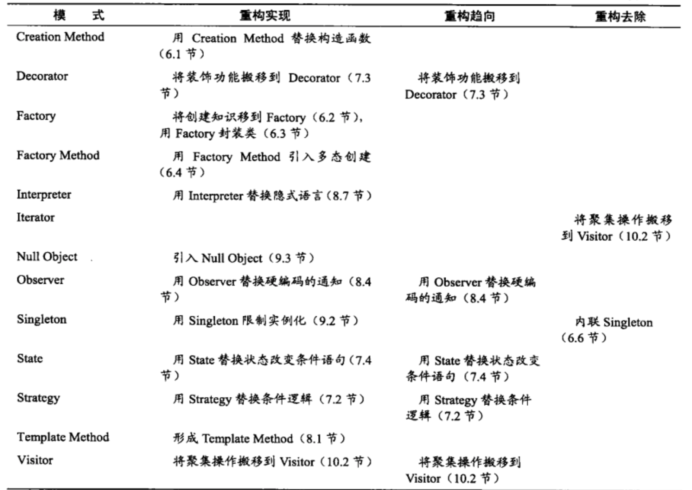
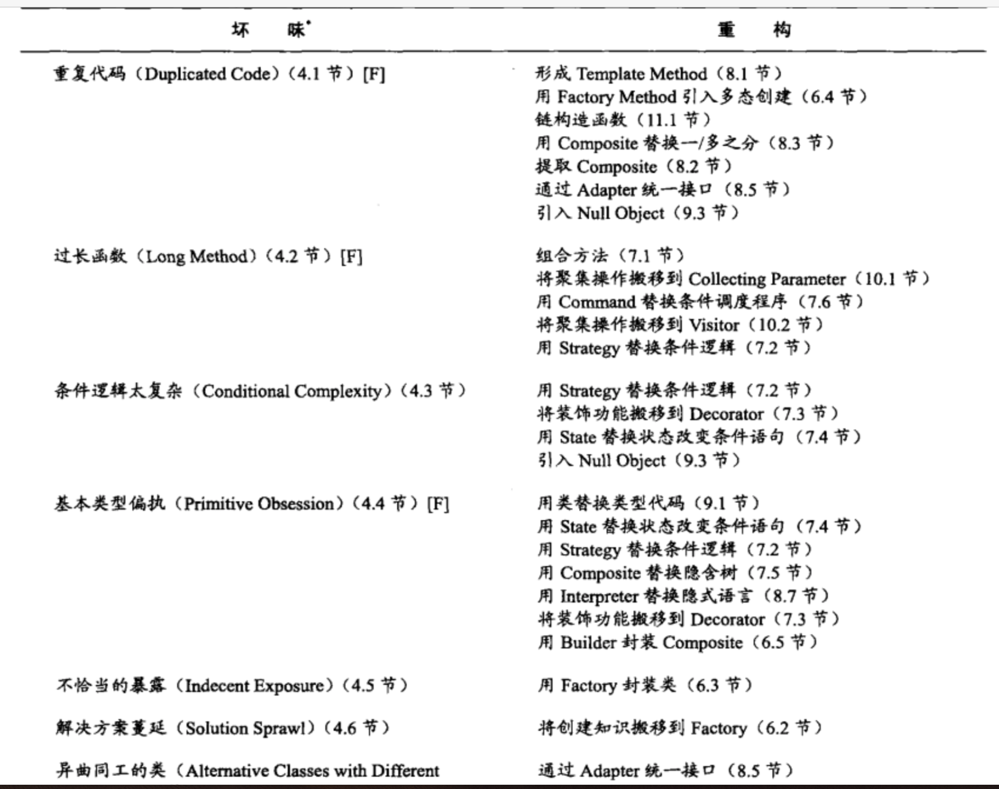
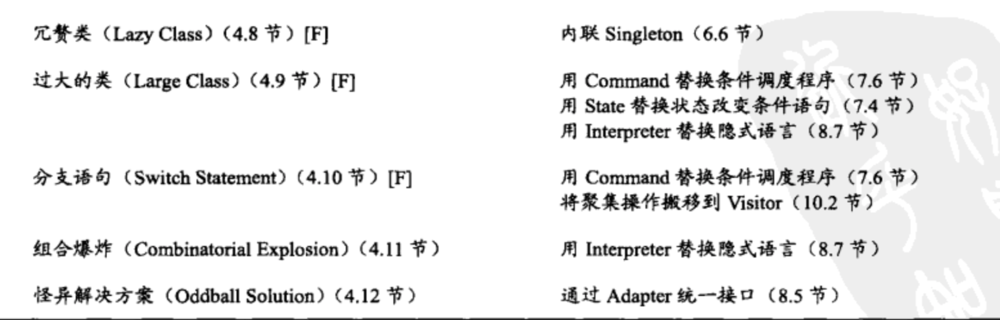
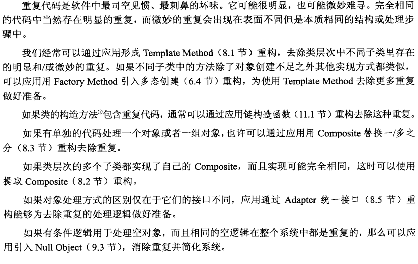
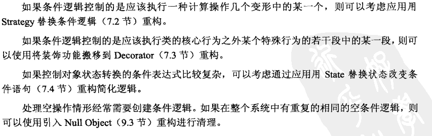
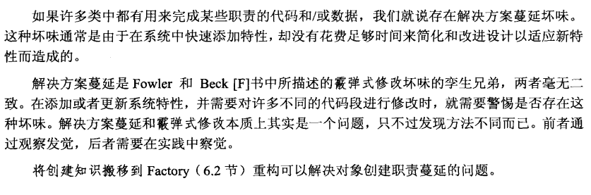

## 写这本书的原因
1. 过度设计
2. 设计不足
3. 测试驱动开发和持续重构 两个重要实践降低过度设计和设计不足的几率
4. 重构与模式 密不可分的关系：在许多重构方法中，模式有助于改进设计。 许多时候我们通过重构实现模式，或者趋向模式进行重构。模式与重构之间存在天然联系。模式是你想到达的目的地，而重构则是从其他地方抵达这个目的地的条条道路。 
5. 渐进式设计 => 重构实现模式或者重构趋向模式

## 重构
### 目的
1. 使新代码的增加更容易 （降低耦合）
2. 改善既有的代码的设计 
3. 对代码的理解更透彻 
4. 提高编程的趣味性 （减少dirty work，比如降低处理check in冲突的巨类的存在）

## 模式
何谓模式？
每个模式是由三个部分组成的规则：
1. 某一个环境
2. 一个问题
3. 解决问题方案

### 通过重构实现,趋向和去除模式

### 模式是不是使代码变得更复杂
1. 缺乏对模式的认知
2. 进一步重构十分必要
3. 谨慎采用模式的预先设计

### 代码坏味
1. 重复
2. 不清晰
3. 复杂

### 重复代码

### 过长函数
1. 避免重复代码
2. 提高阅读性
3. <= 10 行以内
4. 小函数串起来几乎对性能无影响， 对条件分支过长的 可以考虑用command 模式， strategy等模式来替换

### 条件逻辑太复杂

### 基本类型偏执
1. 不要用基本类型值来控制类的逻辑，应该考虑用类替换类型代码重构.这样将得到类型安全而且能够扩展新行为的代码.

### 不太恰当的暴露
1. 利用工厂方法或 工厂模式 隐藏类的构造过程中的复杂逻辑

### 解决方案蔓延

### 异曲同工的类

